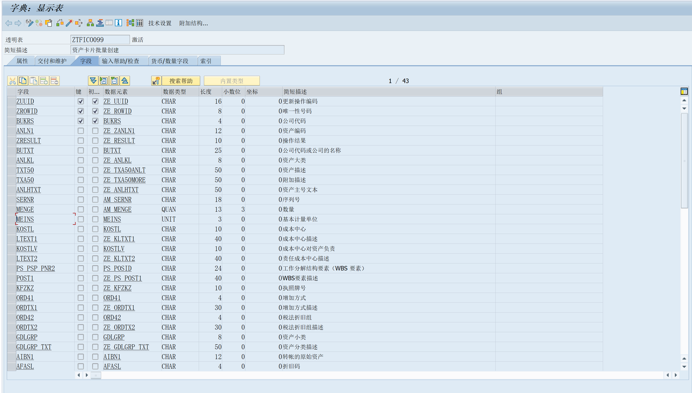
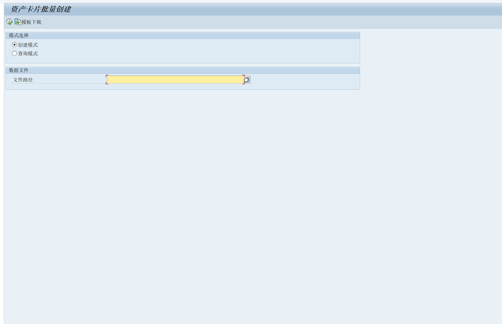
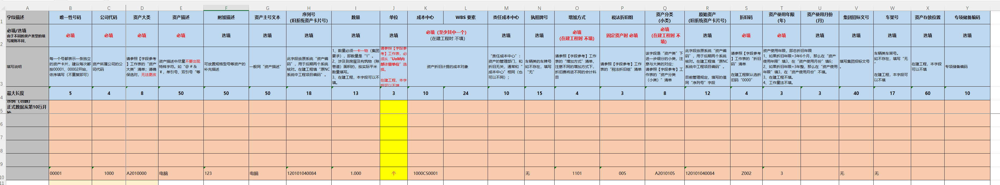
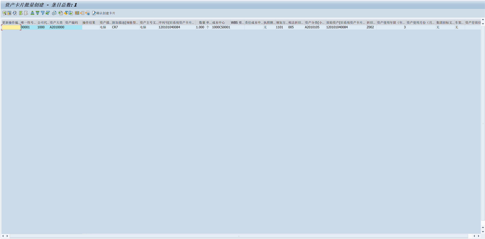
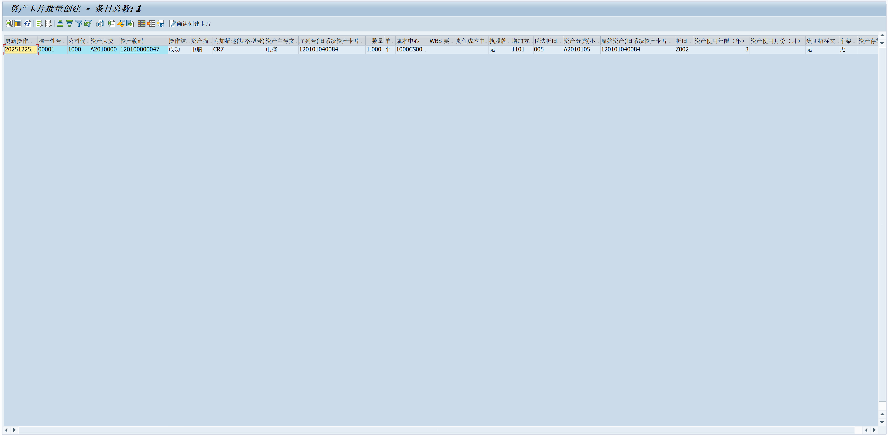
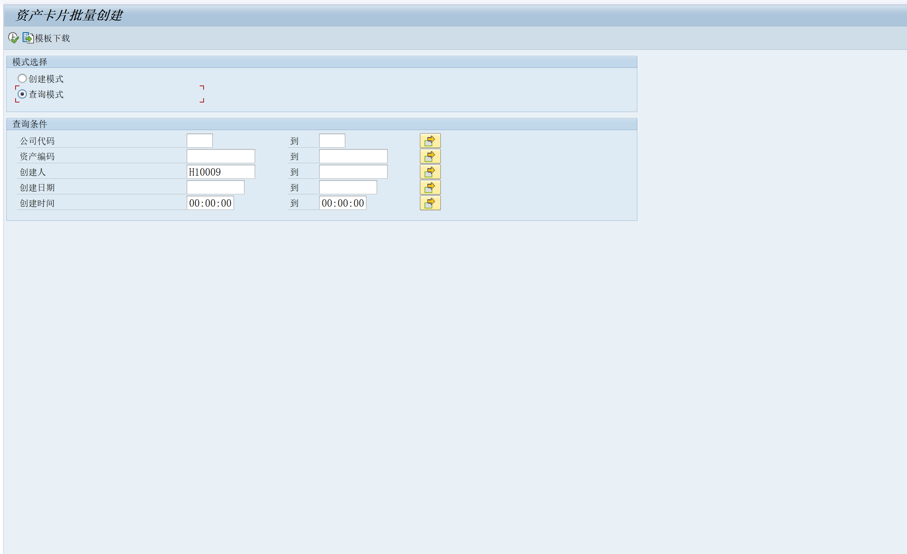
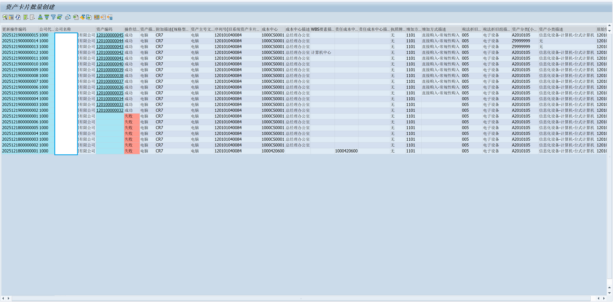

#### 通过 BAPI_FIXEDASSET_CREATE1 批量创建资产卡片的程序

ZTFICO099 表元素

程序界面：

创建模式 中，导入 EXCEL 模板 中 资产数据

Excel 中数据 示例：

导入数据后，展示EXCEL 中数据 的 ALV :

点击  确认创建卡片 按钮后，更新后的 ALV ：

查询模式中，查看批量创建操作的记录和结果：

查询模式展示的ALV:

