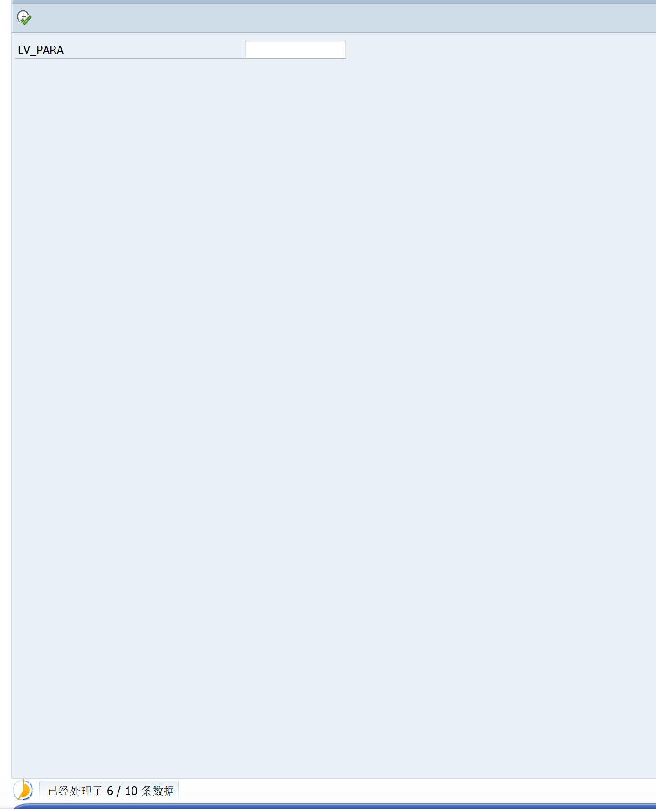

#### 程序运行时显示进度条

使用 SAPGUI_PROGRESS_INDICATOR 函数

```ABAP
CALL FUNCTION 'SAPGUI_PROGRESS_INDICATOR'
   EXPORTING
     PERCENTAGE       = LV_PERCENTAGE
     TEXT             = LV_STR.
```


在程序运行时，左下角展示 程序的运行和处理进度

